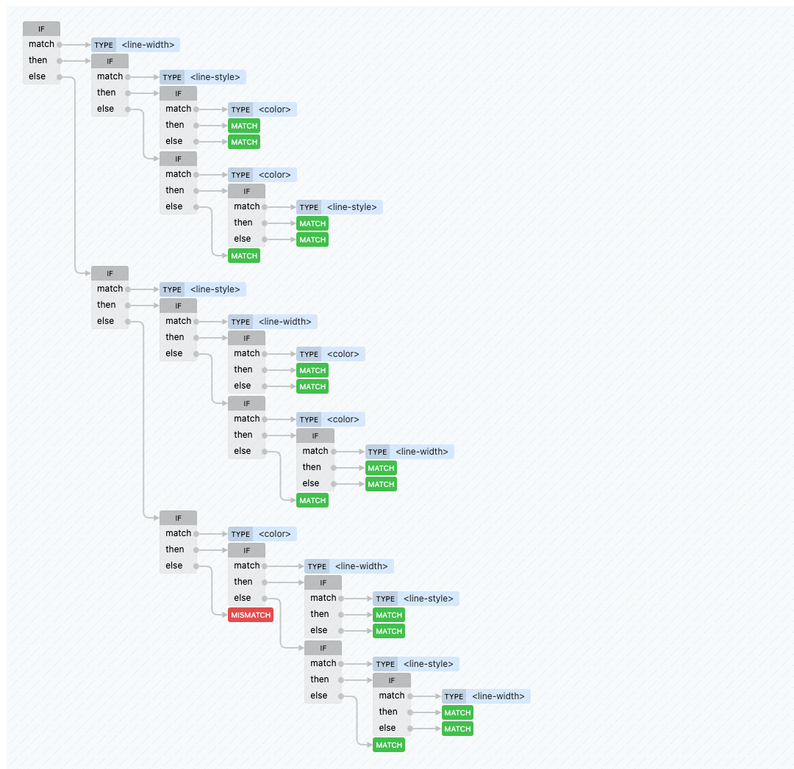

# css-tree match graph create react component

This repository reworks [csstree matchGraph](https://csstree.github.io/docs/syntax/#Property:border) as a React component.

## storybook demo
https://kurata321.github.io/match-graph/?path=/story/example-matchgraph--border

## install
```shell
npm i 'kurata321/match-graph.git'
# or
yarn add 'kurata321/match-graph.git'
```

## usage
```tsx
import { MatchGraph } from "match-graph";

<MatchGraph name="border" />
```

then... like this

